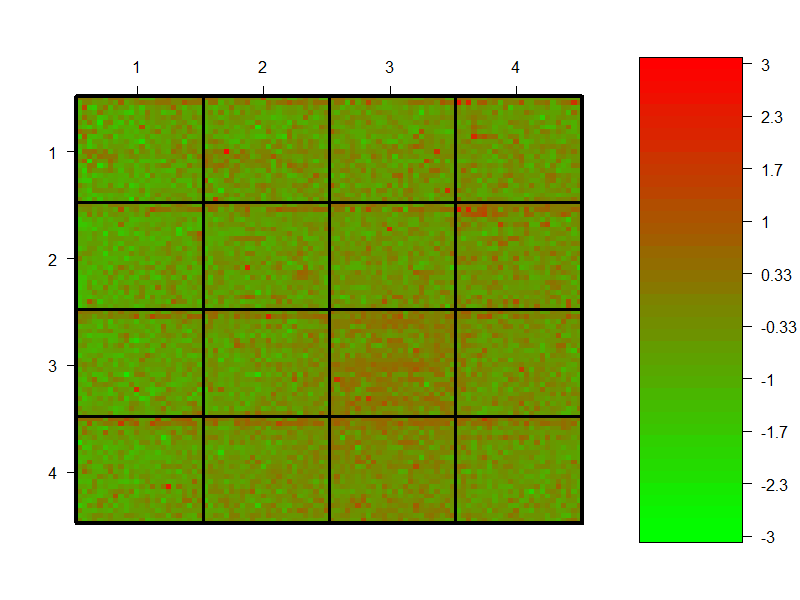
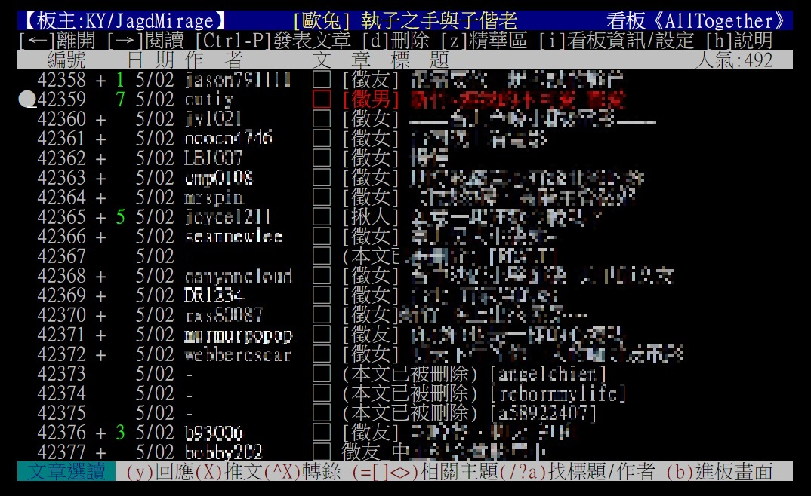
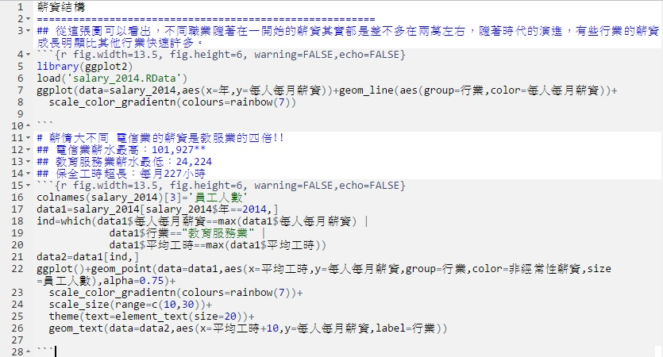
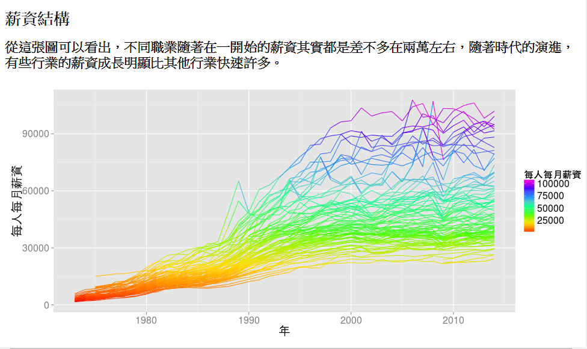

---
title: Visualization with R
author: 陳奎銘
hitheme     : zenburn      
framework: impressjs
text: "Slidify with impress.js!"
widgets    : [bootstrap, quiz, shiny, interactive]
runtime: shiny
mode  : standalone
--- #title x:8176 y:1500 

<p style='width:1000px;font-size:95px;
                text-align:center'>Explore the world with</p>
<p style='text-align:center'></img></p>
<font size=7> Taiwan R user Group </font>
<p><font size=6><b> 陳奎銘 (Ben) </b></font>
<font size=5>benjamin0901@gmail.com</font>


--- #intro x:8043 y:2279  

<q> **陳奎銘(Ben)** </q>

<p><b><font size=6>學歷</font></b></p>
  - <p><font size=6 color='orange'>陽明大學醫學放射技術學系</font></p>
  - <p><font size=6 color='orange'>陽明大學生物醫學資訊研究所</font></p>

<p><b><font size=6>工作經歷</font></b></p>
  - <p><font size=6 color='orange'>和鑫生技開發股份有限公司研發工程師</font></p>
  - <p><font size=6 color='orange'>R user group officer</font></p>
  - <p><font size=6 color='orange'>普生股份有限公司研發工程師</font></p>

<p><b><font size=6>程式語言：</font></b><font size=6 color='orange'>R & Matlab</font></p>

--- #microarray x:7052 y:2437 z:0



--- .slide x:6192 y:2817 z:0 rotx:-60 z:-100
<br>
<p style='width:800px;font-size:50px'>R的推廣經歷</p>
<br>
<p><b><font size=5>2005/??</font></b></p>
  - <p><font size=6 color='orange'>R的初體驗</font></p>

<p><b><font size=5>2012/10</font></b></p>
  - <p><font size=6 color='orange'>加入Taiwan R User Group</font></p>

<p><b><font size=5>2013/08</font></b></p>
  - <p><font size=6 color='orange'>Coscup</font></p>

<p><b><font size=5>2013/11</font></b></p>
  - <p><font size=6 color='orange'>中興大學 OSSF</font></p>

<p><b><font size=5>2014/01</font></b></p>
  - <p><font size=6 color='orange'>中研院  OSSF</font></p>

<p><b><font size=5>2014/08</font></b></p>
  - <p><font size=6 color='orange'>2014/08-- 資料科學愛好者年會</font></p>

--- #what x:5201 y:2758
<p style='width:800px;font-size:200px;text-align:center'>What's R</p>

--- #its-in-3d x:5201 y:3258 z:-100 rotx:40 roty:-10 scale:2

<span class="have">language</span> <span class="and">and</span> <span class="noticed">enviroment</span> for <span class="its">statistical computing </span> <span class="in">and</span> graphics<sup></sup>

--- #Why x:4105 y:3117 scale:1 rotx:-60 

<p style='width:800px;font-size:200px;text-align:center'>Why R</p>

--- #graphics x:2964 y:3139 rotx:-45 roty:-45
<q> **強大的視覺化效果** </q>
<p style='text-align:center'></img></p>
<font size=4> <p style='text-align:center'>圖片來源：http://www.r-bloggers.com/mapping-the-worlds-biggest-airlines/</p></font>


--- #packages x:1837 y:3073 rotx:45
<q> **大量套件支援** </q>
<p style='text-align:center'></img></p>
<font size=4> <p style='text-align:center'>圖片來源：http://blog.revolutionanalytics.com/2013/11/cran-now-has-5000-r-packages.html</p></font>

--- #Popular x:787 y:2922 z:-100 scale:2 rotx:45 roty:45
<q> **使用者眾** </q>
<p style='text-align:center'></img></p>
<font size=4> <p style='text-align:center'>圖片來源：https://www.kaggle.com/wiki/Software</p></font>

--- #tools x:-130 y:2694 z:-100 scale:2 rotx:90
<q> **輕易與其他工具整合** </q>
```{r, fig.cap="",echo=FALSE,warning=FALSE,message=FALSE,fig.width=8,fig.height=6,fig.align='center'}
library("wordcloud")
wordcloud(words=c('ggmap','Rcpp','googleVis','XML','rpy2','R.matlab','rJava','Rmarkdown','RMySQL','rmongodb','RHadoop','Rjason','OpenStreetMap'),freq=seq(10,20,0.8),rot.per=0,fixed.asp = FALSE,colors=rainbow(20, alpha = 1)[8:20])
```

--- #example x:-866 y:2402 z:-100 scale:2

# 實際案例

--- #girlfriend x:-1379 y:2062 rotx:-90

# 小明想要找個女朋友....

--- #girlfriend1 x:-1643 y:1691

# <p style='text-align:center'> Ptt </p>
# <p style='text-align:center'> Alltogether </p>

--- #alltogether x:-1643 y:1309
<q> **但是，有些文章還沒看就被刪了...** </q>


--- #girlhour x:-1379 y:738 rotx:60
<q> **找出女孩們最常PO文的時間！** </q>
```{r,echo=FALSE,fig.width=13.6}
library(ggplot2)
load('girltime.RData')
girlhour=as.data.frame(as.numeric(substring(regmatches(girltime,regexpr('[0-9]*:[0-9]*:[0-9]*',girltime)),1,2)))
colnames(girlhour)='girlhour'

girlhour=summary(factor(girlhour$girlhour))
girlhour=as.data.frame(girlhour)
colnames(girlhour)='counts'
girlhour$time=factor(0:23)
ggplot(data=girlhour,aes(x=time,y=counts))+geom_bar(stat='identity',aes(fill=counts))+scale_fill_gradient(low='yellow',high='red')+theme(text=element_text(size=30))
```

--- #savepoor x:-266 y:598 
<q> **震驚！台灣公開薪資數據！** </q>
<iframe src="http://win.dgbas.gov.tw/dgbas04/bc5/EarningAndProductivity/Default.aspx" width=800 height=600></iframe>


--- #salary x:470 y:306
<q> **歷年薪資分佈(googleVis)** </q>
<iframe src='http://spark.rstudio.com/kmchen/salary/' width=800 height=600></iframe>

--- #report1 x:1087 y:178 z:-1000


<p style='width:800px;font-size:200px;text-align:center'>報告</p>

--- #report2 x:1837 y:-273 z:-1000 
<q> **markdown with R** </q>


--- #report3 x:2964 y:-139 z:2000 
<q> **markdown with R** </q>


--- #Rsalary x:4105 y:-117 z:0
<q> **R skills attract the highest salaries** </q>
<p style='text-align:center'></img></p>
<font size=4> <p style='text-align:center'>圖片來源：<a href='http://a2.typepad.com/6a0105360ba1c6970c01a73d7580ea970d-pi'>http://a2.typepad.com/6a0105360ba1c6970c01a73d7580ea970d-pi</p></a></font>

--- #GBC x:5201 y:-8
公司希望利用各種biomarker建立一個預測肝纖維化的model

--- #Model x:6192 y:183
<q> **利用各種Data Mining的套件** </q>

    library(randomForest)
    library(e1071)
    library(MASS)
    model1=randomForest(bi~a+b+c+d+e
                       ,data)
    model2=svm(bi~a+b+c+d+e,data)
    model3=lda(bi~a+b+c+d+e,data)
    model4=lm(bi~a+b+c+d+e,data)

--- #shiny x:7024 y:445
# 以Shiny提供App服務

--- #shinyfibro x:7652 y:763 

<iframe src='http://spark.rstudio.com/kmchen/fibro/' width=1000 height=500></iframe>

--- #data science x:8043 y:1121 rotx:90 z:1000
<q> **Data Science** </q>

<p style='text-align:center'></p>
<font size=4> <p style='text-align:center'>圖片來源：<a href='http://www.datasciencecentral.com/profiles/blogs/data-scientist-core-skills'>http://www.datasciencecentral.com/profiles/blogs/data-scientist-core-skills</p></a></font>

---.slide x:8716 y:1500 rotx:90
<br>
<font size=7>教學資源</font><br><br>
 <font size=6>Cook Book for R: <br>http://www.cookbook-r.com/<br><br>
 Cheat Sheets: http://www.rstudio.com/resources/cheatsheets/</font>
<br><br>
<font size=7>Taiwan R User Group</font><br><br>
 <font size=6>資料分析上手課程: http://taiwanrusergroup.github.io/DSC2014Tutorial/<br><br>
 MLDM Monday: https://www.youtube.com/user/TWuseRGroup</font>


--- #R x:3250 y:1500 scale:3
<p style='text-align:center'></img></p>