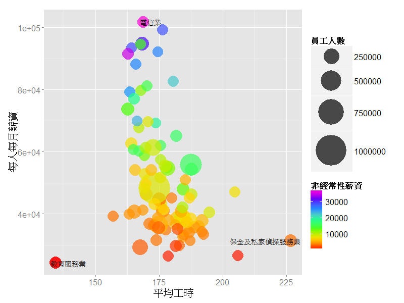

薪資結構
========================================================
## 從這張圖可以看出，不同職業隨著在一開始的薪資其實都是差不多在兩萬左右，隨著時代的演進，有些行業的薪資成長明顯比其他行業快速許多。
```{r fig.width=13.5, fig.height=6, warning=FALSE,echo=FALSE}
library(ggplot2)
load('salary_2014.RData')
ggplot(data=salary_2014,aes(x=年,y=每人每月薪資))+geom_line(aes(group=行業,color=每人每月薪資))+
  scale_color_gradientn(colours=rainbow(7))+theme(text=element_text(size=20))

```
# 薪情大不同 電信業的薪資是教服業的四倍!!
>> ## 電信業薪水最高：101,927**
>> ## 教育服務業薪水最低：24,224
>> ## 保全工時超長：每月227小時

</img>