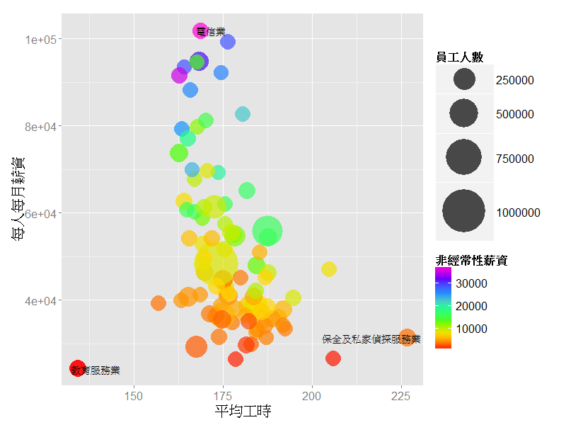

薪資結構
========================================================
## 從這張圖可以看出，不同職業隨著在一開始的薪資其實都是差不多在兩萬左右，隨著時代的演進，有些行業的薪資成長明顯比其他行業快速許多。
 

# 薪情大不同 電信業的薪資是教服業的四倍!!
>> ## 電信業薪水最高：101,927**
>> ## 教育服務業薪水最低：24,224
>> ## 保全工時超長：每月227小時

</img>
